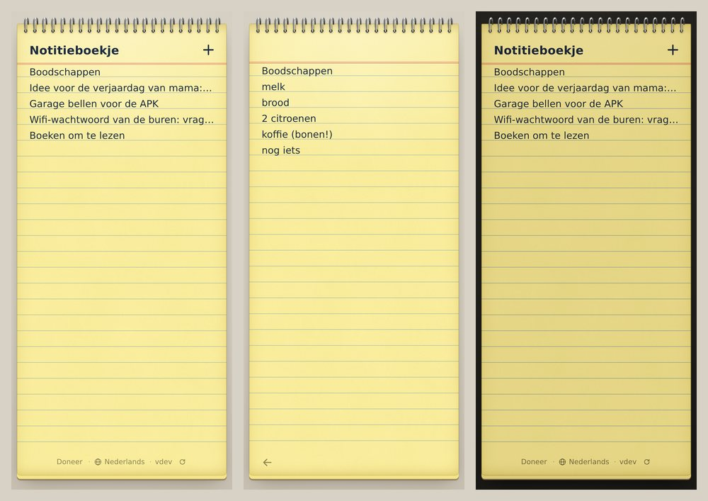

# Notitieboekje

**A little yellow notebook for your phone. No account, no ads, free.** → **[notitieboekje.vanali.workers.dev](https://notitieboekje.vanali.workers.dev)**



Open it and it feels like holding a small yellow reporter's notebook: spiral binding along the top, light-yellow ruled pages, your words sitting right on the lines. That is all it is.

- **Home page = your pages.** Each page is shown by its first line. Tap one to keep writing, tap **+** for a new page.
- **Just write.** Enter is a new line. Everything is saved while you type. A small arrow at the bottom takes you back.
- **Tear a page out** by swiping it aside. Changed your mind? Tap "Undo" within five seconds. A page you leave empty is simply not kept. Keyboard and screen reader users: press Delete on a page, or use the hidden "Tear out" button; long-press shows it on touch screens.
- **Everything stays on your device.** No login, no server, no database, no sync, no backup, no analytics, no requests to other sites. Your pages live in your browser's local storage and nowhere else. Clearing your browser data erases them.
- **Works offline** after the first visit and installs as an app (PWA).
- **23 languages**, picked from your browser: English, Dutch, French, German, Spanish, Portuguese, Polish, Ukrainian, Russian, Turkish, Arabic, Urdu, Hindi, Bengali, Indonesian, Vietnamese, Chinese, Japanese, Korean, Swahili, Tamazight (Tifinagh), Kurdish and Shona. Right-to-left for Arabic and Urdu.
- **Light.** Plain HTML, CSS and JavaScript, no framework, no build step. The only bundled font is Noto Sans Tifinagh (SIL Open Font License), because most devices lack it.
- **Open source (MIT)** on Cloudflare Workers static assets; fits easily in the free plan.

Sister projects: [Whenly](https://github.com/boulbaal/whenly) (pick a date with a group) and [Evenly](https://github.com/boulbaal/evenly) (split costs with a group). Questions or bugs: [open an issue](https://github.com/boulbaal/notitieboekje/issues).

Notitieboekje is free and stays free. If it helps you, you can [buy the maker a coffee via PayPal](https://www.paypal.com/paypalme/ABoulbahaiem).

---

*Nederlands*

**Een klein geel notitieboekje op je telefoon, zonder account en zonder reclame.** De beginpagina toont je blaadjes met hun eerste regel; tik erop om verder te schrijven, of op + voor een nieuw blaadje. Alles wordt meteen bewaard, alleen op je eigen toestel (geen server, geen synchronisatie, geen back-up). Veeg een blaadje opzij om het uit te scheuren; "Ongedaan maken" brengt het terug.

## Techniek

| Onderdeel | Keuze |
|---|---|
| Hosting | Cloudflare Workers, alleen Static Assets (geen worker-code, geen database) |
| Opslag | `localStorage` op het toestel, sleutels `notitieboekje.n.<id>`; zonder opslag (privévenster) werkt alles in het geheugen |
| Frontend | `public/index.html`, `style.css`, `app.js`, `i18n.js`; systeemlettertype, enkel Tifinagh meegeleverd |
| Offline | `public/sw.js`: app-schil in een cache per versie; de verversknop in de voet haalt een nieuwe versie meteen binnen |
| Lijnen | regelhoogte = lijnafstand; `app.js` meet de basislijn van het lettertype zodat de tekst op de lijn staat |
| Testen | Playwright: desktop 1280x800 en telefoon 360 en 390 breed, plus statische controles |

## Testen draaien

```
npm install
npm test
```

`npm test` start zelf een kleine statische server (`tools/serve.mjs`) die de headers uit `public/_headers` toepast. Schermafdrukken: `npm run serve` en daarna `npm run shots` (in `screenshots/`). Iconen en OG-afbeelding opnieuw tekenen: `npm run icons` (Python met Pillow).

## Online zetten

```
npm install
npx wrangler login
git commit -am "..." && npm run deploy
```

`tools/deploy.mjs` weigert een werkboom met niet-gecommitte wijzigingen, kopieert `public/` naar `dist/`, zet het korte commitnummer in plaats van `__VERSION__` (in `app.js` en `sw.js`) en draait `npx wrangler deploy --config dist/wrangler.toml`.

## Licentie

MIT
